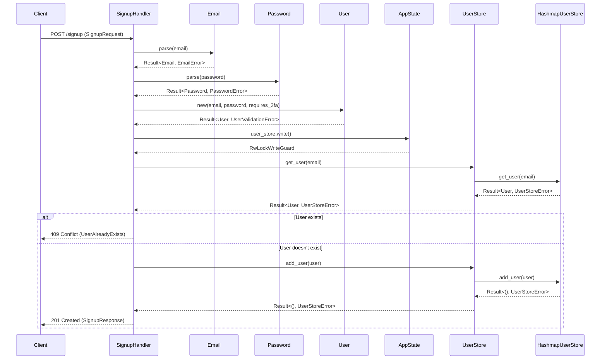

# Auth Service UML Diagram

## Class Diagram

```mermaid
classDiagram
    %% Main Application Layer
    class Application {
        -server: Serve~Router, Router~
        +address: String
        +build(app_state: AppState, address: &str) Result~Self, Box~dyn Error~~
        +run(self) Result~(), std::io::Error~
    }

    class AppState {
        +user_store: UserStoreType
        +new(user_store: UserStoreType) Self
    }

    %% Domain Layer
    class User {
        +email: Email
        +password: Password
        +requires_2fa: bool
        +new(email: &str, password: &str, requires_2fa: bool) Result~Self, UserValidationError~
    }

    class Email {
        -0: String
        +parse(address: &str) Result~Self, EmailError~
        +as_str() &str
    }

    class Password {
        -0: String
        +parse(password: &str) Result~Self, PasswordError~
    }

    %% Data Store Layer
    class UserStore {
        <<interface>>
        +add_user(user: User) Result~(), UserStoreError~
        +get_user(email: &Email) Result~User, UserStoreError~
        +validate_user(email: &Email, password: &Password) Result~(), UserStoreError~
    }

    class HashmapUserStore {
        -users: HashMap~Email, User~
        +default() Self
    }

    %% Error Types
    class AuthAPIError {
        <<enumeration>>
        UserAlreadyExists
        InvalidCredentials
        UnexpectedError
    }

    class UserValidationError {
        <<enumeration>>
        InvalidEmail
        InvalidPassword
        UnexpectedError
    }

    class UserStoreError {
        <<enumeration>>
        UserAlreadyExists
        UserNotFound
        InvalidCredentials
        UnexpectedError
    }

    class EmailError {
        <<enumeration>>
        InvalidEmail(String)
        UnexpectedError
    }

    class PasswordError {
        <<enumeration>>
        InvalidPassword
        UnexpectedError
    }

    %% Request/Response DTOs
    class SignupRequest {
        +email: String
        +password: String
        +requires_2fa: bool
    }

    class SignupResponse {
        +message: String
    }

    class ErrorResponse {
        +error: String
    }

    %% Route Handlers
    class SignupHandler {
        +signup(State~AppState~, Json~SignupRequest~) Result~impl IntoResponse, AuthAPIError~
    }

    class LoginHandler {
        +login() impl IntoResponse
    }

    class LogoutHandler {
        +logout() impl IntoResponse
    }

    class Verify2FAHandler {
        +verify_2fa() impl IntoResponse
    }

    class VerifyTokenHandler {
        +verify_token() impl IntoResponse
    }

    %% Relationships
    Application --> AppState : uses
    AppState --> UserStore : contains
    HashmapUserStore ..|> UserStore : implements
    User --> Email : contains
    User --> Password : contains
    User --> UserValidationError : creates
    Email --> EmailError : creates
    Password --> PasswordError : creates
    HashmapUserStore --> User : stores
    HashmapUserStore --> UserStoreError : returns
    SignupHandler --> AppState : uses
    SignupHandler --> User : creates
    SignupHandler --> Email : validates
    SignupHandler --> Password : validates
    SignupHandler --> AuthAPIError : returns
    SignupHandler --> SignupRequest : receives
    SignupHandler --> SignupResponse : returns
    AuthAPIError --> ErrorResponse : converts to
```

## Sequence Diagram - User Signup Flow

## Component Interaction Overview

### Layer Architecture:

1. **Presentation Layer**: Route handlers (signup, login, logout, etc.)
2. **Application Layer**: Application struct and AppState
3. **Domain Layer**: User, Email, Password value objects
4. **Infrastructure Layer**: HashmapUserStore implementation

### Key Interactions:

- **Application** orchestrates the web server and routes
- **AppState** holds the user store dependency
- **Route handlers** validate input using domain objects
- **User** aggregates Email and Password value objects
- **HashmapUserStore** implements the UserStore trait for data persistence
- **Error handling** flows from domain errors to API errors

### Method Flow:

1. HTTP request → Route handler
2. Route handler → Domain validation (Email/Password parsing)
3. Domain validation → User creation
4. User creation → UserStore operations
5. UserStore operations → Response generation
6. Response generation → HTTP response
